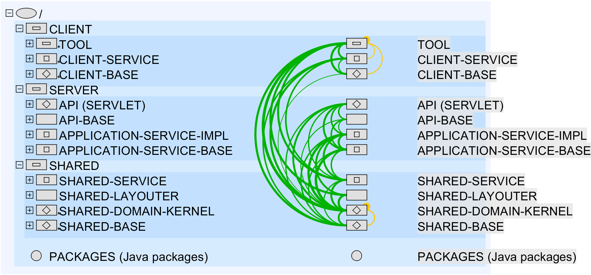

## Delegs Architektur ##

### Eckdaten ###

| Allgemein                |        |
|--------------------------|--------|
| LOC                      | 124873 |
| Relevant LOC             | 87237  |
| Modules                  | 97     |
| Packages                 | 112    |
| Project Files (logical)  | 541    |
| Project Files (physical) | 541    |
| Library Files            | 0      |
| Classes                  | 1473   |
| Methods                  | 12714  |

| Details                 |        |
|-------------------------|--------|
| __Outbound References__ | 0      |
| - Violations            | 0      |
| - Tolerated Violations  | 0      |
| - Calls                 | 0      |
| - Inheritances          | 0      |
| __Inbound References__  | 0      |
| - Violations            | 0      |
| - Tolerated Violations  | 0      |
| - Calls                 | 0      |
| - Inheritances          | 0      |
| __Inner References__    | 86839  |
| - Violations            | 0      |
| - Tolerated Violations  | 138    |
| - Calls                 | 36175  |
| - Inheritances          | 567    |
| __Downward References__ | 29601  |
| - Violations            | 0      |
| - Tolerated Violations  | 0      |
| - Calls                 | 9114   |
| - Inheritances          | 109    |
| __Upward References__   | 20     |
| - Violations            | 0      |
| - Tolerated Violations  | 20     |
| - Calls                 | 9      |
| - Inheritances          | 1      |

### Ist-Zustand ###

Die delegs Anwendung besteht im wesentlich aus 3 Bestandteilen:

- dem Server Teil im Ordner `/prod` 
- dem Shared Teil im Ordner `/src/de/signwritingeditor/shared`
- und dem Client Teil im Ordner `/src/de/signwritingeditor/client`

Im Server Teil befindet sich sämtliche Logik, die auf dem Server ausgeführt wird. Dies beinhaltet unter anderem Logik für Persistierung, Videokonvertierung, PDF-Generierung, User-Management und dem Versand von E-Mails.

Der Shared Teil besteht primär aus POJOs (Plain Old Java Objects), welche sowohl vom Frontend als auch vom Backend benötigt werden. (DDD: Domain Values, WAM: Materialien)

Die darauf aufbauenden GWT basierten UI Bestandteile liegen im Client Teil.

### Soll-Zustand ###

Im Laufe der Jahre haben sich bei der Entwicklung einige Architekturverletzungen eingeschlichen. Diese haben wir beim Projektabschluss
sotographiert. Nachfolgend eine kompakte und eine detaillierte Ansicht der Soll-Architektur inkl. der gelb markierten Verletzungen, mit anschließenden Gedanken und Hinweisen für eine mögliche Optimierung. 

Kompakte Ansicht

 

Detailansicht

 

Hinweise zur Optimierung / zum Beheben der Architekturverletzungen:

- Der DocumentEditor sollte den SignEditor nicht direkt erzeugen und aufrufen, sondern dies über den bereits existierenden Listener außerhalb des DocumentEditors tun.
- VideoRecorderDialogBox, 120: Die Konstante sollte an anderer Stelle deklariert werden: uploadForm.setAction(DocumentEditorSidebar.videoSupplierUrl);
- LocalSessionServiceImpl: Der Listener gehört nicht in die Klasse (Zeilen 401-406). 
- Pair: Warum wird keine Java-Standardklasse verwendet?

- Die Typen FontSizeService + …Impl sollten in ein Shared-Package verschoben werden.
- SymbolCategoryAnalyzer in BodyBaseSymbol verschieben?
- Der SymbolToHeadSymbolConverter (Domain-Model) nutzt den HeadSymbolLayouter (oberhalb Domain-Model). Entweder gehört die „Layout-Funktionalität“ an dieser Stelle doch ins Model (weil so grundlegend (Arrangement der Kopfsymbole)), oder die Layout-Funktionalität muss aus der Converter-Klasse in die Layouter-Klasse hochgezogen werden.
- CheckBoxFiringMouseEvents, HTMLParagraph, ListItem, TextAreaWithWatermark und vermutlich weitere Client-/UI-Klassen werden nicht genutzt und können gelöscht werden.
- Das SHARED-SERVICE/misc-Subsystem ist sehr durcheinander.
- FreeTextTokenDataStorage ist wie ein Repo benannt, ist aber ein Datenobjekt

- I18NAccess lässt sich nicht ohne Architekturverletzung sauber einordnen und müsste aufgeteilt werden:
  - Die statische Variable I18NAccess.I18N wird in I18NAccess nur deklariert, aber nicht gesetzt. Dieser Teil verbleibt in SHARED-BASE.
  - Die übrigen I18N-Konstanten in der Klasse müssten herausgezogen und oberhalb der Domain-Kernels gesetzt werden (in denen das I18N-Interface für die verschiedenen Sprachen implementiert wird). Das Setzen der Konstanten muss aber jeweils separat in SERVER und CLIENT erfolgen.
  - Die saubere Architektur wäre deutlich weniger elegant und muss auch nicht unbedingt umgesetzt werden – also Architekturverletzung tolerieren.
- I18N sollte BadgeI18NProvider nicht implementieren. Stattdessen sollte BadgeI18NProvider eigenständig, parallel zu I18N verwendet werden.

- Warum heißt die Klasse SignItemEditor „Editor“ (SHARED-Layer)?
- Sign/SimpleSign aus dem SIGN-EDITING sollten nicht den User aus dem USER-MANAGEMENT direkt einbetten, sondern nur den User-Namen als eine Referenz darauf.
  - Analog: User in RoomItem aus DOCUMENT-MANAGEMENT.
  - Analog: User in Document aus DOCUMENT-EDITING.
  - Analog: User in AuthoredObject aus *-EDITING.
- AuthoredObject sollte dupliziert werden, je 1 für die beiden *-EDITING-Domain-Kernels.
- SignItem aus SIGN-EDITING sollte dupliziert werden in DOCUMENT-EDITING. Ggf. kann es dort in der SignItemToken-Klasse aufgehen.
- LocalDictionary aus DICTIONARY sollte nur die Sign-ID verwenden und nicht SimpleSign und SignItem aus SIGN-EDITING.
- SymbolCategoryAnalyzer aus SIGN-EDITING sollte aufgelöst werden und jeweils von den Klassen, die ihn verwenden, implementiert werden.
- NOTIFICATION ist nicht wirklich eine Subdomäne. Sollte besser dem Notification-Service in SHARED-SERVICE zugeordnet werden.
